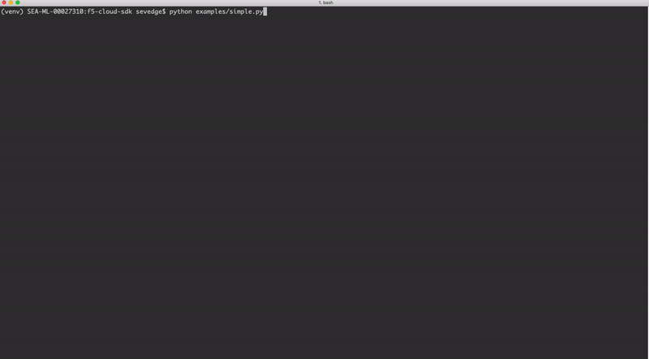

# F5 SDK

## Table of Contents
- [Introduction](#introduction)
- [Documentation](#documentation)
- [Developer Setup](#developer-setup)
- [Artifacts](#artifacts)

## Introduction

This project provides a use case focused python SDK for interacting with F5 products, specifically around cloud and automation.



## Documentation

See the [user documentation](https://cloudsolutions.pages.***REMOVED***/f5-cloud-sdk/code-docs) for details on installation, usage and much more.

## Developer Setup

During developement, it is recommended to make use of the specific pinned dependencies, including test dependencies, defined inside of requirements.txt instead of a production installation via `setup.py`.

### Installation

Note: A virtual environment should be created first.  See [python docs](https://docs.python.org/3/library/venv.html) for more details.

```bash
pip install -r requirements.txt && pip install .
```

Note: This project prefers Python 3.x, however if testing against python 2.x you should use either:

- A virtual environment
- Python 2.7 in a container - `docker run --rm -it -v $(pwd):/usr/dir python:2.7 /bin/bash`

### Testing

This project uses `Make` as a build automation tool... check out the Makefile for the full set of recipes.

- Run unit tests: ```make unit_test```
- Run linter: ```make lint```
- Build code coverage documentation: ```make coverage```
- Build code documentation: ```make code_docs```

## Artifacts

- Index: https://cloudsolutions.pages.***REMOVED***/f5-cloud-sdk
- Code coverage report: https://cloudsolutions.pages.***REMOVED***/f5-cloud-sdk/coverage/
- Code documentation: https://cloudsolutions.pages.***REMOVED***/f5-cloud-sdk/code-docs/

